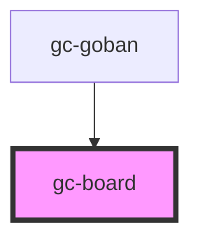

# gc-board

<!-- Auto Generated Below -->

## Properties

| Property  | Attribute | Description | Type                                                              | Default                                                                          |
| --------- | --------- | ----------- | ----------------------------------------------------------------- | -------------------------------------------------------------------------------- |
| `ghosts`  | --        |             | `any[]`                                                           | `[]`                                                                             |
| `options` | --        |             | `{ order: boolean; zoom: number; style: { texture: boolean; }; }` | `{     order: false,     zoom: 100,     style: {       texture: false     }   }` |
| `overlay` | --        |             | `any[]`                                                           | `[]`                                                                             |
| `size`    | `size`    |             | `number`                                                          | `19`                                                                             |
| `state`   | --        |             | `any[]`                                                           | `[]`                                                                             |

## Events

| Event         | Description | Type               |
| ------------- | ----------- | ------------------ |
| `moveAttempt` |             | `CustomEvent<any>` |

## Dependencies

### Used by

 - [gc-goban](../goban)

### Graph

----------------------------------------------

*Built with [StencilJS](https://stenciljs.com/)*
