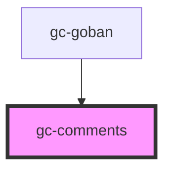

# gc-comments

<!-- Auto Generated Below -->

## Properties

| Property   | Attribute  | Description | Type     | Default |
| ---------- | ---------- | ----------- | -------- | ------- |
| `path`     | --         |             | `any[]`  | `[]`    |
| `position` | `position` |             | `number` | `0`     |

## Events

| Event        | Description | Type               |
| ------------ | ----------- | ------------------ |
| `addComment` |             | `CustomEvent<any>` |

## Dependencies

### Used by

 - [gc-goban](../goban)

### Graph

----------------------------------------------

*Built with [StencilJS](https://stenciljs.com/)*
