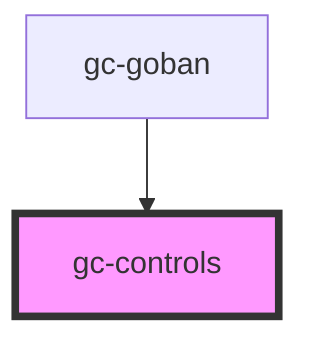

# gc-controls

<!-- Auto Generated Below -->

## Properties

| Property     | Attribute    | Description | Type     | Default |
| ------------ | ------------ | ----------- | -------- | ------- |
| `data`       | `data`       |             | `any`    | `{}`    |
| `history`    | --           |             | `any[]`  | `[]`    |
| `options`    | `options`    |             | `any`    | `{}`    |
| `position`   | `position`   |             | `number` | `0`     |
| `score`      | `score`      |             | `any`    | `{}`    |
| `variations` | `variations` |             | `any`    | `{}`    |

## Events

| Event            | Description | Type               |
| ---------------- | ----------- | ------------------ |
| `download`       |             | `CustomEvent<any>` |
| `optionChange`   |             | `CustomEvent<any>` |
| `selectPosition` |             | `CustomEvent<any>` |

## Dependencies

### Used by

 - [gc-goban](../goban)

### Graph

----------------------------------------------

*Built with [StencilJS](https://stenciljs.com/)*
