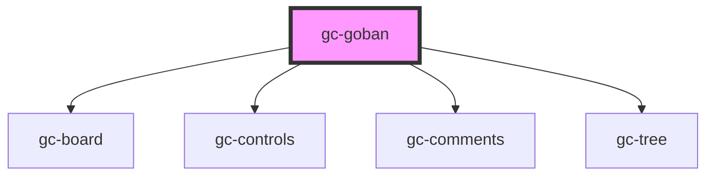

# gc-goban

<!-- Auto Generated Below -->

## Properties

| Property          | Attribute          | Description | Type     | Default                                                                                                                                                                                                 |
| ----------------- | ------------------ | ----------- | -------- | ------------------------------------------------------------------------------------------------------------------------------------------------------------------------------------------------------- |
| `currentPosition` | `current-position` |             | `number` | `0`                                                                                                                                                                                                     |
| `options`         | `options`          |             | `any`    | `{     play: false,     showOrder: false,     interval: 1,     mode: MODE.READ,     zoom: 100,     comments: false,     controls: false,     tree: false,     style: {       texture: false,     }   }` |
| `sgf`             | `sgf`              |             | `any`    | `null`                                                                                                                                                                                                  |

## Dependencies

### Depends on

- [gc-board](../board)
- [gc-controls](../controls)
- [gc-comments](../comments)
- [gc-tree](../tree)

### Graph

----------------------------------------------

*Built with [StencilJS](https://stenciljs.com/)*
