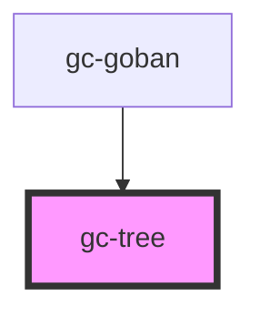

# gc-tree

<!-- Auto Generated Below -->

## Properties

| Property     | Attribute  | Description | Type     | Default |
| ------------ | ---------- | ----------- | -------- | ------- |
| `current`    | --         |             | `any[]`  | `[]`    |
| `position`   | `position` |             | `number` | `0`     |
| `tree`       | --         |             | `any[]`  | `[]`    |
| `variations` | --         |             | `any[]`  | `[]`    |

## Events

| Event             | Description | Type               |
| ----------------- | ----------- | ------------------ |
| `selectPosition`  |             | `CustomEvent<any>` |
| `selectVariation` |             | `CustomEvent<any>` |

## Dependencies

### Used by

 - [gc-goban](../goban)

### Graph

----------------------------------------------

*Built with [StencilJS](https://stenciljs.com/)*
